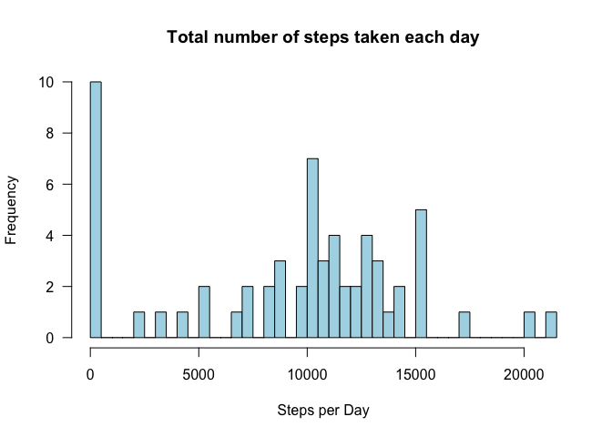
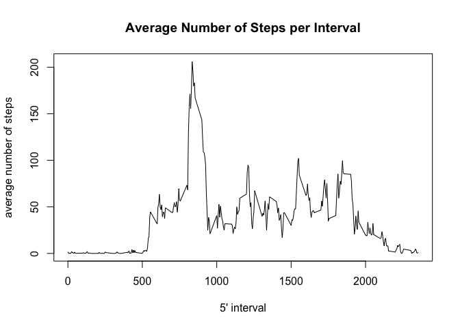
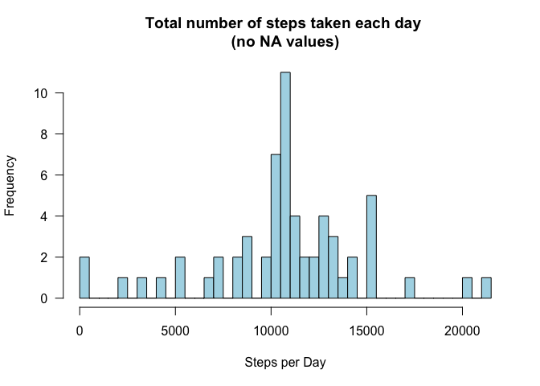
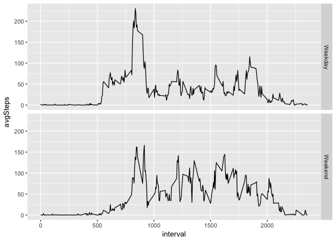

# Report
Coursera, Reproducibile Research

Author: Matej Znidaric 

# Loading and pre-processing the data
Original data can be found on the [link](https://d396qusza40orc.cloudfront.net/repdata%2Fdata%2Factivity.zip)
Steps taken:
1. load the extractep csv file
2. Convert second column to Date


```r
data <- read.csv("activity.csv", na.strings = "NA", header = T)
```


# What is mean total number of steps taken per day? 

* Calculate the total number of steps taken per day

```r
aggByDate <- aggregate(data$steps, by=list(data$date), FUN = sum, na.rm=TRUE)
```

* Make a histogram of the total number of steps taken each day:

```r
hist(aggByDate$x, breaks = 40, las=1, 
     xlab="Steps per Day", ylab="Frequency", col = "lightblue", main="Total number of steps taken each day")
```

<!-- -->

* 

```r
meanbyDate <- mean(aggByDate$x)
```
a) The mean number of steps taken per day is 9354.23.

```r
medianbyDate <- median(aggByDate$x)
```
b) The median number of steps taken per day is 10395.00. 


# What is the average daily activity pattern?

* Make a time series plot (i.e. 𝚝𝚢𝚙𝚎 = "𝚕") of the 5-minute interval (x-axis) and the average number of steps taken, averaged across all days (y-axis)

```r
avgStepsInterval <- aggregate(data$steps, by = list(data$interval), FUN = "mean", na.rm = TRUE)
plot(avgStepsInterval, type = "l", xlab = "5' interval", ylab = "average number of steps", 
    main = "Average Number of Steps per Interval")
```

<!-- -->

* On average across all the days in the dataset, 5' interval number 835 contains the maximum number of steps.


# Imputing missing values


```r
sumNa <- sum(is.na(data$steps))
```
* Total number of missing values in the dataset is: 2304.

* Devise a strategy for filling in all of the missing values in the dataset. The strategy does not need to be sophisticated. For example, you could use the mean/median for that day, or the mean for that 5-minute interval, etc.

Strategy for filling in all of the missing values is mean of the 5' interval. New Data set is named "dataFull"

```r
names(avgStepsInterval)[1] <- "interval"
names(avgStepsInterval)[2] <- "meanByInterval"
dataFull <- merge(data,avgStepsInterval,by="interval")
dataFull[is.na(dataFull$steps),2] <- dataFull[is.na(dataFull$steps),4]
```

* a) Make a histogram of the total number of steps taken each day and 

```r
aggByDateFull <- aggregate(dataFull$steps, by=list(dataFull$date), FUN = sum, na.rm=TRUE)
hist(aggByDateFull$x, breaks = 40, las=1, 
     xlab="Steps per Day", ylab="Frequency", col = "lightblue", main="Total number of steps taken each day \n(no NA values)")
```

<!-- -->


```r
meanbyDateFull <- mean(aggByDateFull$x)
```
b) The new mean number of steps taken per day is 10766.19.


```r
medianbyDateFull <- median(aggByDateFull$x)
```
c) The new median number of steps taken per day is 10766.19. 

d) Do these values differ from the estimates from the first part of the assignment? What is the impact of imputing missing data on the estimates of the total daily number of steps?

yes, the numbers differ 13.11% for a for mean and 3.45% for a median.


# Are there differences in activity patterns between weekdays and weekends?

* Create a new factor variable in the dataset with two levels – “weekday” and “weekend” indicating whether a given date is a weekday or weekend day.

```r
dataFull$date <- as.Date(dataFull$date, format="%Y-%m-%d")
dataFull$dayname <- weekdays(dataFull$date)
daysInWeek <- data.frame(c("Monday", "Tuesday", "Wednesday", "Thursday", "Friday", "Saturday", "Sunday"), c(rep("Weekday",5), rep("Weekend",2)), StringsAsFactors=FALSE)
names(daysInWeek) <- c("dayname", "weekdayClass")
dataFull <- merge(dataFull,daysInWeek,by="dayname")
```

* Make a panel plot containing a time series plot (i.e. 𝚝𝚢𝚙𝚎 = "𝚕") of the 5-minute interval (x-axis) and the average number of steps taken, averaged across all weekday days or weekend days (y-axis). See the README file in the GitHub repository to see an example of what this plot should look like using simulated data.

```r
library(ggplot2)
avgStepsPerIntervalFull <- aggregate(dataFull$steps, by = list(dataFull$interval, dataFull$weekdayClass), FUN = "mean", na.rm = TRUE)
names(avgStepsPerIntervalFull) <- c("interval", "weekdayClass", "avgSteps")
ggplot(data=avgStepsPerIntervalFull,aes(x=interval, y=avgSteps, group=1)) + geom_line() + facet_grid(weekdayClass~.)
```

<!-- -->

* Compute the min, max, mean, median of the steps across all intervals and days by weekdays/weekends

```r
tapply(dataFull$steps,dataFull$weekdayClass,
       function (x) { c(MINIMUM=min(x),MEAN=mean(x),
                        MEDIAN=median(x),MAXIMUM=max(x))})
```

```
## $Weekday
##   MINIMUM      MEAN    MEDIAN   MAXIMUM 
##   0.00000  35.61058   0.00000 806.00000 
## 
## $Weekend
##  MINIMUM     MEAN   MEDIAN  MAXIMUM 
##   0.0000  42.3664   0.0000 785.0000
```


